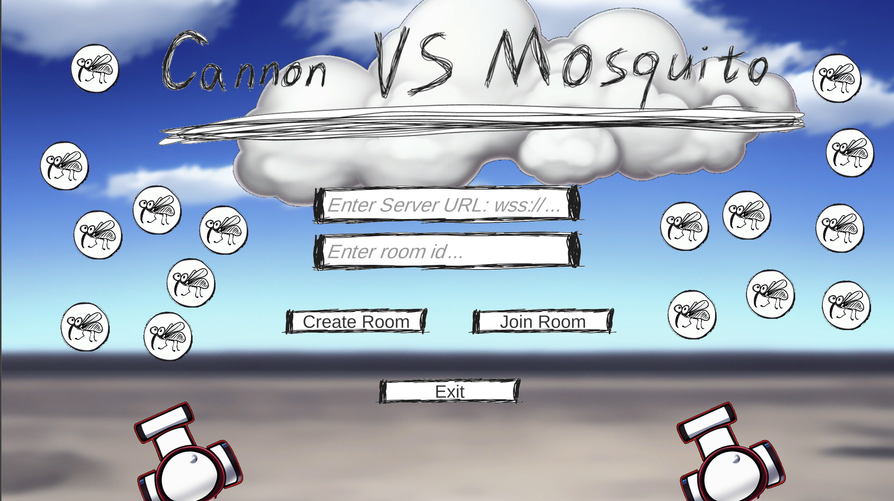

# Cannon VS Mosquito


A demo game made with Unity3D.



## How to Play

### Start the Client

The game is hosted on GitHub Pages, [click me to play](https://discretetom.github.io/CannonVsMosquito/).

### Join a Server or Play with a Mock Server

When the game is started, you will be asked to input the server URL.

- If you omit the server URL, just click `Create Room` or `Join Room`, then the game is started in local mode.
- If you have a server, input the server URL and a room ID, then click `Create Room` or `Join Room`, then the game is started in online mode.
  - Different players with the same room ID will be in the same game room.
  - The maximum number of players in a room is 2.
- If you are developing the server, you can use [this CLI tool](https://github.com/DiscreteTom/ws-server) to mock a server.

> **Note**: You can also pass the server URL and room id in the query string: `https://discretetom.github.io/CannonVsMosquito/?serverUrl=<websocket-address>&room=<room-id>`.

### Play the Game

- If you are the host of the room, you will control the left cannon. Otherwise, you will control the right cannon.
- Use `Space` to shoot.
- If you shoot a mosquito, you will get 1 point. The point is shown on the top of your cannon.
- A game will last 60 seconds. The player with more points wins.

## For Developers

### Network Protocol

After a websocket connection is established, here are the messages that will be sent between the client and the server.

```ts
// ================= From client:
type CreateRoomAction = {
  action: "create";
  room: string;
};
type JoinRoomAction = {
  action: "join";
  room: string;
};
type ShootAction = {
  action: "shoot";
  origin: {
    x: number; // float
    y: number; // float
  };
  // The angle is in degree, anti-clockwise, 0 is right, 90 is up.
  angle: number; // float
};

// ================= From server:
type ServerMessage = {
  type: "error" | "game start" | "player shoot" | "new target" | "game over";
  msg: string; // JSON.stringify of the following types
};
type ErrorEvent = {
  type: string;
};
type GameStartEvent = {
  // Provide a list of initial targets.
  targets: {
    x: number; // float
    y: number; // float
    id: number; // int
  }[];
};
type PlayerShootEvent = {
  hit: number[]; // int[], the ids of the targets that are hit
  player: number; // int, 0 for left, 1 for right
  origin: {
    x: number; // float
    y: number; // float
  };
  angle: number; // float
};
type NewTargetEvent = {
  targets: {
    x: number; // float
    y: number; // float
    id: number; // int
  }[];
};
type GameOverEvent = {
  winner: number; // int, 0 for left, 1 for right
};
```

### Server Logic

- For simplicity, there is no authentication or authorization to establish a websocket connection.
- 2 players with the same room ID will be in the same game room.
- When the 2 players are ready, game start, and the server will send the initial targets to the clients.
- When a client shoot, the server will check if the shot hits any target. The server will broadcast the `player shoot` event to both clients. The clients will play the shoot animation after receiving the event.
- Players can shoot at any time instead of turn by turn. This is not a turn-based game.
  - So you might need to make atom operations on the game state in the server.
- The server will add new targets periodically by sending the `new target` event to the clients.
- When the game is over, the server will send the `game over` event to the clients.

## Resources

### Server Implementation

- Serverless: [yagrxu/aws-game-demo](https://github.com/yagrxu/aws-game-demo)
  - Using Terraform, AWS Lambda, DynamoDB, etc. With Event Driven Architecture.
